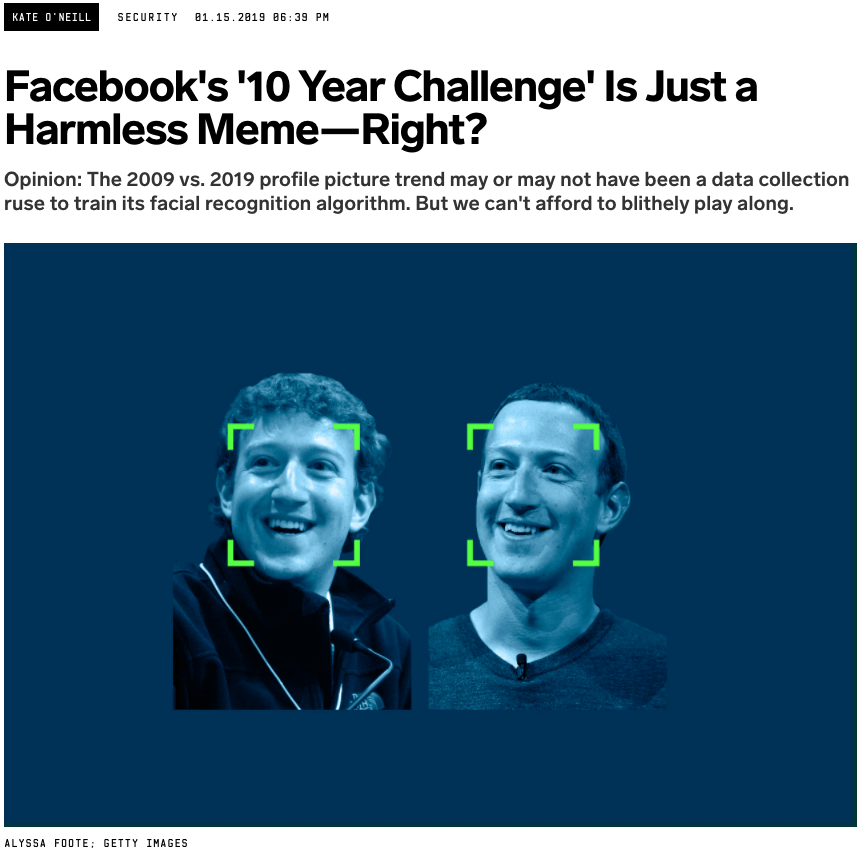
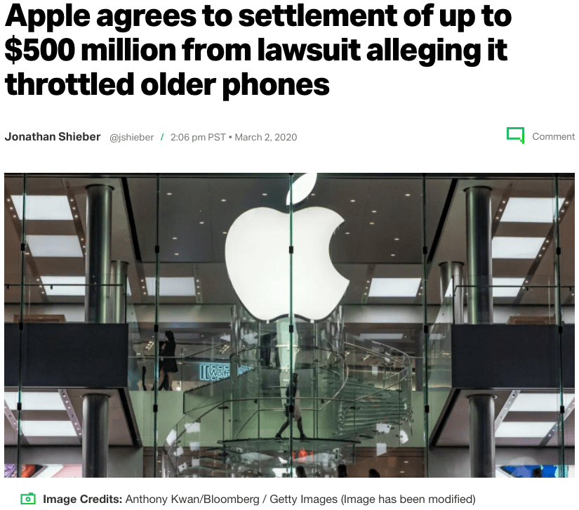
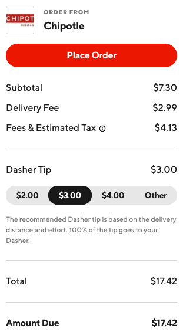

# Ethical Design - Notes

With all the power that technology yields, it comes with tremendous responsibility. This course will introduce Ethical Design, which considers the moral implication of one's work on others. Specifically, we'll focus on tech at the intersection of development, design, and business. We'll reflect on how tricky interfaces and dirty data practices have negative consequences on society. Ethical frameworks and tools will be shared so you can evaluate and align your actions with your values. Techniques for effective advocacy will enable you to nurture human-centered decisions in your organization. This course is for everyone who works in tech, regardless of their role.

---

## What is Ethical Design?

We'll define Ethical Design and explain how it relates to other terms, such as inclusive design, usability, accessibility, privacy, universal design, and human-centered design.

### **New Terms:**

- _Ethical design_: Design ethics concerns moral behavior and responsible choices in the practice of design. It guides how designers work with clients, colleagues, and the end-users of products, how they conduct the design process, how they determine the features of products, and how they assess the ethical significance or moral worth of the products that result from the activity of designing. *source: Encyclopedia.com*
- _Overton window_: the range of policies deemed acceptable to the mainstream population at a given time. source: Wikipedia

### **Further Reading:**

- **[The Tragic Design Book](https://www.tragicdesign.com/)** - by Jonathan Shariat and Cynthia Savard Saucier
- **[Ethical Design Manifesto](https://ind.ie/ethical-design/)** - by Ind.ie, creators of the "Ethical Hierarchy of Needs"

---

## Designing and Developing with Ethics

### **Companies task us with...**

- How fast can you make this?
- How can we grab the most market share and beat the competitors, at any cost?
- How can we scale and increase the bottom line?

### **Further Reading:**

- **[Volkswagen Emissions Scandal](https://en.wikipedia.org/wiki/Volkswagen_emissions_scandal)** - Wikipedia
- **[Uber Greyball](https://en.wikipedia.org/wiki/Greyball)** - Wikipedia

---

## Dark Patterns

### **Definition**

> Dark pattern: A deceitful technique used in websites and apps, where the interface tricks users into doing something they didn't intend to do.

### **Privacy Zuckering**

Privacy Zuckering is when you are tricked into publicly sharing more information about yourself than you really intended to. It's named after Facebook CEO Mark Zuckerberg, as Facebook encourages users to share information about themselves which is then used for ad targeting. Remember the 10 Year Challenge profile picture trend where people posted photos of themselves in 2009 and 2019?

**[Facebook's '10 Year Challenge' Is Just a Harmless Meme---Right?](https://www.wired.com/story/facebook-10-year-meme-challenge/)**

Author Kate O'Neill speculated that Facebook used the data to improve its facial recognition algorithm. While this can innocently be used to suggest names of people to tag in photos, facial recognition software has wide applications that infringe upon peoples' privacy. Clearview AI provides facial recognition software to the U.S. Immigration and Customs Enforcement (ICE). The technology uses 3 billion images scraped from social media sites. Facebook has demanded they stop scraping images from the platform, although Clearview AI is resistant to comply.

So the photos we willingly give for one purpose can be used for a deeper intent. Granted, Facebook already has access to profile photos, but it's not a clean data set. Some aren't portraits, and it may not be clear what date they were taken. O'Neill argues this meme could easily provide a vast dataset of curated profile photos from about 10 years ago to now. And there's no telling how it will be used and who can access it.

### **Friend Spam**

Friend Spam is when a product asks for your email or social media permissions under the pretense it will be used for a desirable outcome but then spams all your contacts on your behalf. LinkedIn offers to help you connect with your friends on the platform by merely sharing your contacts. Sounds helpful, right? Well, embarrassingly enough, it emails your contacts that aren't on LinkedIn. The emails even use your name to make it seem like you were personally inviting them to join LinkedIn.

---

_The next set involves trapping users._

### **Roach Motel**

It's easy to get a booking but challenging to get out. Have you ever upgraded a membership online, but when you wanted to downgrade, you had to call customer support and endure a grueling wait time? When I canceled my gym membership, I had to physically mail in the request. This required finding a printer, which I didn't have. And an envelope and stamp which I had already packed because I was moving. So while I easily signed up onsite, the gym made it difficult to get out.

### **Forced Obsolescence**

In 2020, **[Apple settled a $500 million dollar class-action lawsuit](https://techcrunch.com/2020/03/02/apple-agrees-to-settlement-of-up-to-500-million-from-lawsuit-alleging-it-throttled-older-phones)** that accused the company of intentionally slowing down older phones' performance to encourage new phone purchases. In Apple's apology, they introduced a new feature called "Battery Health," which lets you check the maximum capacity of your battery. So instead of automatically capping performance without explanation, now consumers have insight into the cause of the slowdown and can, theoretically replace the battery to extend the lifespan of the phone.

---

_The next two involve tricking customers into buying._

### **Hidden Costs**

Hidden Costs occur when you discover unexpected charges at the end of a checkout process. **[Food delivery apps notoriously have costly service charges](https://techcrunch.com/2020/03/16/the-hidden-cost-of-food-delivery/)**. This dark pattern is used to keep the perceived cost low, then revealing the true cost at the end, when you may be more committed to the purchase.

---

_The next one involves emotional manipulation._

### **Confirmshaming**

Confirmshaming is the act of guilting the user into opting into something. Have you ever seen a popup take over a website, and the only way to close it is by clicking a link to decline? Instead of simply saying "close", it says "I don't like discounts." It preys on loss aversion and hopes your fear of missing out will urge you to opt into the mailing list. These gimmicks fill users with shame; it's much better to put the user in control and support their preferences.

---

_The final set we'll look at is intentional confusion. I see this often with ads._

### **Disguised Ads**

Sometimes ads are disguised to be part of the app, as you can see on Yelp in the image below. The ads (sponsored results) are mixed into the results with very little differentiation.

---

### **Hard-to-Close Ads and Banners**

Sometimes I accidentally open an ad as I try to close it! In the image below, the X icon is very low contrast and difficult to see. Size also matters; make buttons large enough to easily close. Interactive targets should generally be at least 44 pixels wide.

---

### **Wrap-up**

That's all the dark patterns we have time for now. The website **[darkpatterns.org](https://darkpatterns.org/)** showcases even more examples, and I encourage you to check it out.

### **A Final Note**

Sometimes these tactics work -- at least in the short term. Dark patterns have hidden costs that appear in the form of additional customer service workload, return fees, and PR management. Customer trust can deteriorate, leading to negative reviews and a worsening reputation on social media. It's better to do the right thing and aim for long-term sustainability. More on building the business case later.

### **New Terms:**

- _Dark pattern_: A deceitful technique used in websites and apps, where the interface tricks users into doing something they didn't intend to do.

### **Further Reading:**

- **[Facebook demands Clearview stop using its images for facial recognition](https://www.theverge.com/2020/2/6/21126063/facebook-clearview-ai-image-scraping-facial-recognition-database-terms-of-service-twitter-youtube)** - The Verge
- **[LinkedIn Dark Patterns](https://medium.com/@danrschlosser/linkedin-dark-patterns-3ae726fe1462#.hiqkzc1xd)** - Dan Schlosser on Medium
- **[Understanding Success Criterion 2.5.5: Target Size](https://www.w3.org/WAI/WCAG21/Understanding/target-size.html)** - w3.org

---

## Unintended Consequences and Anti-Patterns

While dark patterns are intentionally deceitful, not all unethical design decisions have bad intent.

### **New Terms:**

- _Anti-pattern_: A common response to a recurring problem that is usually ineffective and risks being highly counterproductive. (**[Wikipedia](https://en.wikipedia.org/wiki/Anti-pattern)**)

### **Further Reading:**

- **[The Social Responsibility of Coding](https://www.youtube.com/watch?v=EAV7RZZOspw)** - Liz Abinante
- **[The Tragic Design Book](https://www.tragicdesign.com/)** - Jonathan Shariat and Cynthia Savard Saucier
- **[The Therac-25: 30 Years Later](https://www.computer.org/csdl/magazine/co/2017/11/mco2017110008/13rRUxAStVR)** - 1993 IEEE Computer Society article

---

## Collecting Data

Let's evaluate consumer surveillance streams and the rise of surveillance capitalism.

### **New Terms:**

- _Cookie_: A cookie is a piece of data sent from a website and stored on the user's computer by the user's web browser.
- _General Data Protection Regulation (GDPR)_: provides data protection and privacy
- _Children's Online Privacy Protection Rule (COPPA)_: provides protection for children under 13 years of age using the internet

### **Further Reading:**

- **[Data and Goliath](https://www.schneier.com/books/data-and-goliath/)** - Bruce Schneier's book
- **[The Age of Surveillance Capitalism](https://www.publicaffairsbooks.com/titles/shoshana-zuboff/the-age-of-surveillance-capitalism/9781610395694/)** - book by Shoshana Zuboff
- **[Corporate Surveillance in Everyday Life](https://crackedlabs.org/dl/CrackedLabs_Christl_CorporateSurveillance.pdf)** - Cracked Labs
- **[General Data Protection Regulation (GDPR)](https://gdpr.eu/)**
- **[Children's Online Privacy Protection Rule ("COPPA")](https://www.ftc.gov/enforcement/rules/rulemaking-regulatory-reform-proceedings/childrens-online-privacy-protection-rule)**
- **[Information privacy law](https://en.wikipedia.org/wiki/Information_privacy_law)** - international data protection regulations
- **[Uber begins background collection of rider location data](https://techcrunch.com/2016/11/28/uber-background-location-data-collection/)** - Techcrunch
- **[Designing forms for gender diversity and inclusion](https://uxdesign.cc/designing-forms-for-gender-diversity-and-inclusion-d8194cf1f51)** - Sabrina Fonseca
- **[Facebook agrees to overhaul targeted advertising system for job, housing and loan ads after discrimination complaints](https://www.washingtonpost.com/business/economy/facebook-agrees-to-dismantle-targeted-advertising-system-for-job-housing-and-loan-ads-after-discrimination-complaints/2019/03/19/7dc9b5fa-4983-11e9-b79a-961983b7e0cd_story.html)** - The Washington Post

---

## Interpreting Data

We'll consider the ethics of drawing conclusions based on data.

### **New Terms:**

- Predictive analytics: The use of statistical techniques to analyze current and historical facts to make predictions about future or otherwise unknown events. - **[Wikipedia](https://en.wikipedia.org/wiki/Predictive_analytics)**

### **Resources:**

- **[Matomo Analytics](https://matomo.org/)**
- **[The Ethical Design Handbook](https://ethicaldesignhandbook.com/)** - by Trine Falbe, Martin Michael Frederiksen, Kim Andersen (find tool recommendations on page 289 in the Best Practices chapter)

### **Further Reading:**

- **[Facebook told advertisers it can identify teens feeling 'insecure' and 'worthless'](https://www.theguardian.com/technology/2017/may/01/facebook-advertising-data-insecure-teens)** - The Guardian
- **[How Companies Learn Your Secrets](https://www.nytimes.com/2012/02/19/magazine/shopping-habits.html?pagewanted=1&_r=1&hp)** - New York Times (Target example)
- **[Data Against People](http://crackedlabs.org/en/data-against-people)** - crackedlabs.org
- **[Matamo Analytics](https://matomo.org/)** - alternative to Google Analytics
- **[Different Customers, Different Prices, Thanks To Big Data](https://www.forbes.com/sites/adamtanner/2014/03/26/different-customers-different-prices-thanks-to-big-data/#370223d65730)** - Forbes
- **[A Special Price Just for You](https://www.forbes.com/sites/neilhowe/2017/11/17/a-special-price-just-for-you/#51cfcec090b3)** - Forbes
- **[Auto Insurance - Consumer Federation of America](https://consumerfed.org/issues/insurance/auto-insurance/)** - price optimization

---

## Sharing Data

We'll consider ethical concerns with sharing data.

### **More examples:**

- In fact, in **[a large academic study](https://blues.cs.berkeley.edu/wp-content/uploads/2018/04/popets-2018-0021.pdf)** of nearly 6,000 of the most popular free children's apps, researchers found that the majority share tracking and behavioral advertising data, mainly due to their misuse of third-party SDKs.
- **[Facebook Says Cambridge Analytica Harvested Data of Up to 87 Million Users](https://www.nytimes.com/2018/04/04/technology/mark-zuckerberg-testify-congress.html)** - Products that extend to third-party developers expose sensitive user data. Facebook revealed data from 87 million users to Cambridge Analytics, a political consulting firm connected to the United States President Trump to influence the 2016 presidential election. Facebook acknowledged a vulnerability that exposed most of its 2 billion users to having their public profile information harvested.

### **Further Reading:**

- **[Grindr Is Letting Other Companies See User HIV Status And Location Data](https://www.buzzfeednews.com/article/azeenghorayshi/grindr-hiv-status-privacy#.dmzvgnJ3Vn)** - Buzzfeed
- **[Parenting club Bounty fined £400,000 for selling users' data](https://www.theguardian.com/technology/2019/apr/12/parenting-club-bounty-fined-selling-users-data)** - The Guardian
- **[Uber begins background collection of rider location data](https://techcrunch.com/2016/11/28/uber-background-location-data-collection/)** - Techcrunch
- **[Uber Ends Its Controversial Post-Ride Tracking Of Users' Location](https://www.npr.org/sections/thetwo-way/2017/08/29/547113818/uber-ends-its-controversial-post-ride-tracking-of-users-location)** - NPR

---

## Research Without Consent

What are the ethics of conducting research studies on digital products?

### **New Terms:**

- _A/B testing_: A research technique where multiple versions of an app are shown to different groups of users, to test the effectiveness of a change.

### **Further Reading:**

- **[The Little Book of Design Research Ethics](https://lbodre.ideo.com/)** - IDEO
- **[Everything We Know About Facebook's Secret Mood Manipulation Experiment](https://www.theatlantic.com/technology/archive/2014/06/everything-we-know-about-facebooks-secret-mood-manipulation-experiment/373648/)** - The Atlantic
- **[The Social Dilemma](https://www.thesocialdilemma.com/)** - Movie

---

## The Deeper Negative Impacts on Society

There are many ways technology impacts society; we'll look at addictive technology and then you'll get a chance to explore more impacts.

### **New Terms:**

- _Pickups_: Pickups in Apple's Screen Time report is the number of times you have picked up your device. Per **[The Verge](https://www.theverge.com/2018/9/17/17870126/ios-12-screen-time-app-limits-downtime-features-how-to-use)**, turning on the screen does not count as a pickup; one must interact with the screen to be considered a pickup.

### **Further Reading:**

- **[Hooked: How to Build Habit-Forming Products](https://www.nirandfar.com/hooked/)** - by Nir Eyal
- **[Indistractable: How to Control Your Attention and Choose Your Life](https://www.nirandfar.com/indistractable/)** - by Nir Eyal
- **[Dear Facebook, this is how you're breaking democracy](https://www.ted.com/talks/yael_eisenstat_how_facebook_profits_from_polarization)** - TED talk by Yaël Eisenstat
- **[Social Media Confessions Bingo](https://drive.google.com/file/d/1juAZCcmRpNNjXajXnm0KOS-9fFUhPI3q/view)** - The Social Dilemma
- **[The Social Dilemma](https://www.thesocialdilemma.com/)** - Documentary on Netflix

---

## Unsafe Content, Misinformation, and Harassment

We'll look at the ways in which digital products can harbor unsafe content, misinformation, and harassment.

### **Further Reading:**

- **[Community Standards](https://www.facebook.com/communitystandards/)** - Facebook
- **[Volksverhetzung](https://en.wikipedia.org/wiki/Volksverhetzung)** - German law protecting against hate speech
- **[Facebook Runs Up Against German Hate Speech Laws](https://www.nytimes.com/2016/11/28/technology/facebook-germany-hate-speech-fake-news.html)** - NY Times
- **[Facebook's Hate Speech Algorithms Leave Out Some Languages](https://time.com/5739688/facebook-hate-speech-languages/)** - Time
- **[Defining "Online Harassment": A Glossary of Terms](https://onlineharassmentfieldmanual.pen.org/defining-online-harassment-a-glossary-of-terms/)** [trigger warning]
- **[Twitch reckons with sexual assault as it begins permanently suspending streamers](https://www.theverge.com/2020/6/25/21303185/twitch-sexual-harassment-assault-permanent-bans-streamers)** - The Verge
- **[Behind the Screen](https://yalebooks.yale.edu/book/9780300235883/behind-screen)** - book by Sarah T. Roberts
- **[Block Party app](https://www.blockpartyapp.com/)** - online harassment tool

---

## Perpetuating Bias and Amplifying Hate with Artificial Intelligence

Machine learning opens up a substantial ethical debate, as it can perpetuate bias and amplify hate. We'll look at real-world examples where AI got it wrong, and then we'll explore some best practices to prevent mistakes.

### **New Terms:**

- _Artificial intelligence (AI)_: creating intelligent machines that can simulate human thinking
- _Machine learning_: A subset of AI; the ability for the computer to analyze information and then create new rules, enabling the computer to learn and create on its own

### **Further Reading:**

- **[Algorithmic Justice League](https://www.ajl.org/)**
- **[Weapons of Math Destruction](https://weaponsofmathdestructionbook.com/)** - book by Cathy O'Neil
- **[Dear Facebook, this is how you're breaking democracy](https://www.ted.com/talks/yael_eisenstat_how_facebook_profits_from_polarization)**
- **[When It Comes to Gorillas, Google Photos Remains Blind](https://www.wired.com/story/when-it-comes-to-gorillas-google-photos-remains-blind/)** - Wired
- **[Machines Taught by Photos Learn a Sexist View of Women](https://www.wired.com/story/machines-taught-by-photos-learn-a-sexist-view-of-women/)** - Wired
- **[The spread of true and false news online](https://science.sciencemag.org/content/359/6380/1146)** - study in Science magazine
- **[Emerging Policy Approaches to AI Adoption](https://events.technologyreview.com/video/watch/rashida-richardson-policy-approaches-ai-adoption/)** - MIT Technology Review
- **[Who's watching the algorithms?](https://www.lowyinstitute.org/the-interpreter/who-s-watching-algorithms)** - Lowy Institute
- **[Why Does Siri Sound White](https://conveyux.com/notes-for-why-does-siri-sound-white/)** - ConveyUX conference
- **[Alan Cooper's keynote "The Oppenheimer Moment"](https://interaction18.ixda.org/program/keynote--alan-cooper/)** - IxDA 2018
- **[How I'm fighting bias in algorithms | TED Talk](https://www.ted.com/talks/joy_buolamwini_how_i_m_fighting_bias_in_algorithms)** - Joy Buolamwini
- **[Soap dispenser sensor that doesn't recognize darker skin tone](https://www.facebook.com/chukwuemeka.afigbo/videos/vb.100000271453784/1666843806667985/?type=2&theater)** - Facebook video
- **[Free Speech Is Not the Same As Free Reach](https://www.wired.com/story/free-speech-is-not-the-same-as-free-reach/)**
- **[Dirty Data, Bad Predictions: How Civil Rights Violations Impact Police Data, Predictive Policing Systems, and Justice](https://papers.ssrn.com/sol3/papers.cfm?abstract_id=3333423)** - by Rashida Richardson, Jason Schultz, and Kate Crawford
- **[Algorithms of Oppression: How Search Engines Reinforce Racism](https://nyupress.org/9781479837243/algorithms-of-oppression/)** - book by Safiya Umoja Noble
- **[The Bias Embedded in Algorithms | Pocket](https://blog.getpocket.com/2020/06/the-bias-embedded-in-algorithms/)** - articles curated by Safiya Umoja Noble
- **[Race After Technology](https://www.ruhabenjamin.com/race-after-technology)** - book by Ruha Benjamin
- **[Automating Inequality | Virginia Eubanks | Macmillan](https://us.macmillan.com/books/9781250074317)** - book by Virginia Eubanks

---

## Use an Ethical Framework

Let's look at "A Designer's Code of Ethics" by Mike Monteiro.

### **Further Reading:**

- **[A Designer's Code of Ethics](https://muledesign.com/2017/07/a-designers-code-of-ethics)** - by Mike Monteiro
- **[Ruined by Design](https://www.ruinedby.design/)** - by Mike Monteiro

---

## Tools for Change

Here are some tools for evaluating the ethical maturity of a digital product.

### **Tools:**

- **[Ethical Design Handbook - Scorecards](https://ethicaldesignhandbook.com/)**
- **[Investigating Consequences with Our Ethics Assessment](https://spotify.design/article/investigating-consequences-with-our-ethics-assessment)** - Spotify Design team
- **[The Tarot Cards Of Tech](http://tarotcardsoftech.artefactgroup.com/)**
- **[Ethics for Designers - Toolkit](https://www.ethicsfordesigners.com/tools)**

### **Further Reading:**

- **[Daily Ethical Design](https://alistapart.com/article/daily-ethical-design)** - A List Apart

---

## Advocate Effectively

Here are techniques you can use to advocate for ethical design.

### **New Terms:**

- _Human-Centered Design (HCD)_: A philosophy defined by "the active involvement of users and a clear understanding of user and task requirements". Developed by Don Norman (among others). Definition from the User Experience Professionals Association (UXPA)
- _ICE_: U.S. Immigration and Customs Enforcement (see link below for further reading)

### **Further Reading:**

- **[How to get started with an inclusive design by Cora Cowles](https://teamtreehouse.com/library/how-to-get-started-with-inclusive-design-with-cora-cowles)** - Treehouse Festival 2020
- **[Amazon warehouse workers strike to protest inhumane conditions](https://www.theverge.com/2019/7/16/20696154/amazon-prime-day-2019-strike-warehouse-workers-inhumane-conditions-the-rate-productivity)** - The Verge
- **[Hundreds of workers defy Amazon rules to protest company's climate failures](https://www.theguardian.com/technology/2020/jan/27/amazon-workers-climate-protest)** - The Guardian
- **[ICE](https://en.wikipedia.org/wiki/U.S._Immigration_and_Customs_Enforcement)** - Wikipedia
- **[ICE Contract With GitHub Sparks Developer Protests](https://www.theatlantic.com/technology/archive/2020/01/ice-contract-github-sparks-developer-protests/604339/)** - The Atlantic

---

## Build the Business Case for Ethical Decisions

Let's understand the business case for making products more ethical.

### **New Terms:**

- _Risk Matrix_: A chart used to define the level of risk by considering the probability of something happening against the resulting severity of the consequence. Used in risk assessment for businesses to decide on priorities of tasks.

### **Build the business case for ethical decisions**

- It's a global trend (future-proofing)
- It protects the brand's reputation
- It's costly not to do it; it's part of software maintenance
