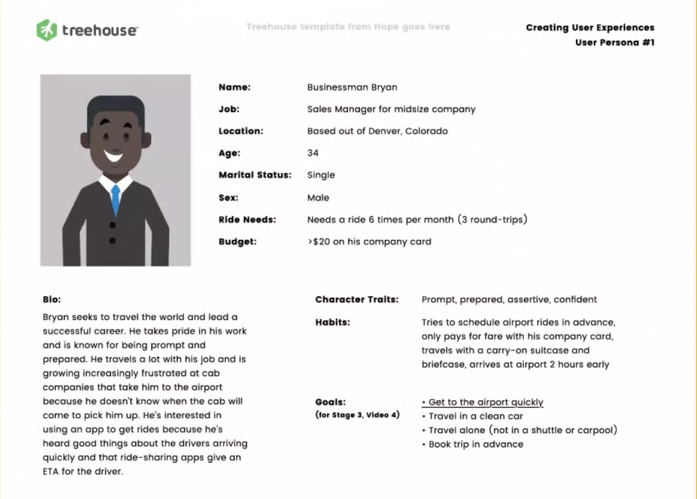
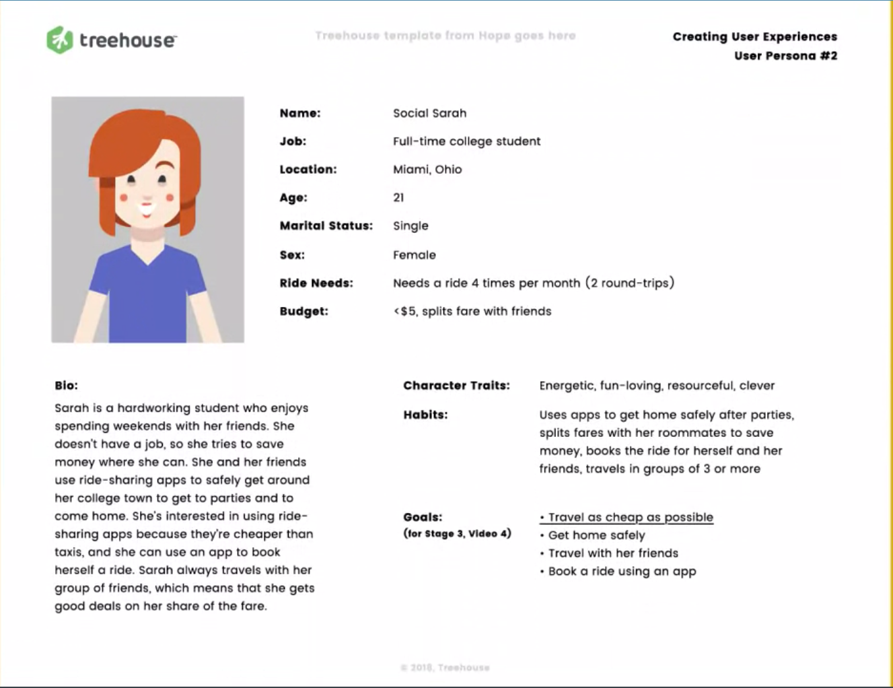

# Creating User Experiences - Notes

Join us as we learn the basic principles of User Experience Design and how it shapes everyday interactions with products. By structuring products around users’ needs, we can ensure that the products do their job. You will learn how to meet users where they are, think through intuitive experiences, and create products that more effectively meet both your goals and your end users’ goals. This course will help you think more critically through the steps and decisions a user makes while interacting with your product. If you’re considering a career in User Experience (UX) or want to learn more about it, this course will expose you to how to design and plan around the people who use your product.

---

## Welcome to User Experience

### **New Terms:**

- **UX:** User Experience is used to describe the ways people interact with products and the effects the interaction has. A good user experience is well-planned, but a bad user experience may not have any planning at all.

### **Further Reading:**

- **[User Personas](https://www.usability.gov/how-to-and-tools/methods/personas.html)**
- [**Agile Coaching Tip: What is an empathy map?**](https://www.solutionsiq.com/resource/blog-post/what-is-an-empathy-map/) by David Bland
- **[Optimization Glossary: User Flows](https://www.optimizely.com/optimization-glossary/user-flow/)**

---

## Who Are Users?

We define who users are and how they can differ from each other.

### **New Terms**

- User - A user is someone who interacts with products in order to reach a goal
- Demographic - A particular sector of the population
- Psychographic - A qualitative methodology used to describe consumer attributes

---

## Why Do Users’ Experiences Matter?

By understanding the value in User Experience, we can better empathize with users to deliver products and services that are tailored to their needs.

### **Further Reading:**

**[Wikipedia: The Curse of Knowledge cognitive bias](https://en.wikipedia.org/wiki/Curse_of_knowledge)** - A cognitive bias that occurs when an individual, communicating with other individuals, unknowingly assumes that the others have the background to understand

---

## UX Basic Theory

The whole point of User Experience design is to build an experience around your users’ expectations. Learn how your users think, and build the experience so it feels natural and intuitive.

### **Further Reading:**

**[The Definition of User Experience (UX)](https://www.nngroup.com/articles/definition-user-experience/)**, by Don Norman and Jakob Nielsen

---

## UX vs. UI Design

Although people say “UX/UI Design,” they are two separate things. User Experience (UX) is how it works, and User Interface (UI) is how it looks.

### **New Terms:**

- User interface (UI) - The visual components and layout that make up what users see as they interact with the product

---

## UX in Context

Build a strong, research-based foundation for your product as it’s developed.

### **Further Reading:**

- **[How A Complete Novice Learned User Testing In 10 Minutes](https://uxmastery.com/learn-user-testing-in-10-minutes/)**, by Matthew Magain
- **[Simple Tips to Improve User Testing](https://theblog.adobe.com/simple-tips-to-improve-user-testing/)**, by Nick Babich

---

## The Importance of Users

Users are the reason you have a product in the first place. If a restaurant didn’t have diners or a sports arena didn’t have fans, they would go out of business. Likewise, it’s key to make your users happy so they stick around.

---

## The Importance of Designing for Users

You need to make it as easy as possible for users to do what they want. If your users don’t understand what’s happening or they don’t understand how your product works, they’ll abandon your product for something that’s easier to use.

---

## Determining Your Users' Personas

User personas represent the most common types of users you have. It’s important to realize that these are stereotypes and that individual users will act differently than the groups you put them in, but it would be insane to create a user map for the millions of users who could use your product, which is why we group people into personas.

### **New Terms:**

- User persona - The user profile of a theoretical user who represents a larger group of potential users. These user profiles are helpful in putting a name and a face with decisions you make about your users.

### **Further Reading:**

- **[Here is a link to the X-Games site](http://xgames.espn.com/xgames/)**. The site and subject matter are designed to appeal to a younger audience.
- This article breaks down how to make User Personas: **[How to Define a User Persona](https://careerfoundry.com/en/blog/ux-design/how-to-define-a-user-persona/)**, by Raven Veal.
- **[Personas Make Users Memorable for Product Team Members](https://www.nngroup.com/articles/persona/)**, by Aurora Harley
- **[A Closer Look At Personas: What They Are And How They Work](https://www.smashingmagazine.com/2014/08/a-closer-look-at-personas-part-1/)**, by Shlomo "Mo" Goltz. This article delves into the history of user personas, starting with Alan Cooper’s research.

---

## Empathy for Your Users

Now that we have our user personas and know a little bit about them, we should keep them in mind as we make choices from here on out. We should create products that fit their needs, and one of the best ways to assess what they need is filling out empathy maps.

### **New Terms:**

- Empathy map - A tool used to put UX designers in a user’s shoes, which is used to consider the user’s perception of what happens as they use the product. This helps shape our insights into our users and lets us focus on what their thoughts and feelings may be.

### **Further Reading:**

This article from Nielsen Norman Group sums up empathy mapping extremely well:

- **[Empathy Mapping: The First Step in Design Thinking](https://www.nngroup.com/articles/empathy-mapping/)**, by Sarah Gibbons

---

## Understanding Your Users' Goals

Your audience will use your product for something specific, like to buy a shirt, to file their taxes online, or to get a ride. It’s up to you to help them meet their needs!

### **Further Reading**

- **[Designing for Goals](https://uxplanet.org/designing-for-goals-a62cd4bd66e)**, by Brian McKenna, addresses the importance of identifying User Goals.

---

## Thinking of Your Goals

You probably want to make money at the end of the day, but you need to provide your customers with the service they’re looking for in order to make them happy and get their business.

### **Further Reading**

This article discusses how business goals can be determined, especially within the context of a larger company.

- **[Aligning UX Strategy with Business Goals](http://uxpamagazine.org/aligning_ux_business_goals/)**, by Sarah Bloomer, Lori Landesman, and Susan J. Wolfe.

---

## Combining Your Goals With Your Users’ Goals

You get the picture: your user has goals, and so do you. Are your goals the same? Your customer may want a new car, and you may want thousands of dollars. It’s important to see what the goals have in common: the customer trades thousands of dollars (what you want) for the car (what the customer wants).

### **Further Reading:**

This UX Planet article talks about how both user and business goals can be combined.

- **[UX Strategy v UX Design: The Ideal UX PRocess](https://uxplanet.org/ux-strategy-v-ux-design-the-ideal-ux-process-3273aa15db9)**, by Justinmind and Jaime Levy.

Though it’s an older article, this does a great job of explaining how user goals and business goals can work together (or go against each other).

- **[User Goals and Corporate Goals](http://tynerblain.com/blog/2009/06/22/user-goals-and-corporate-goals/)**, by Tyner Blain

---

## Structuring Experiences Around Specific Goals

We’ve talked about goals, but how can we measure something like “Learn more about how to save the polar bears”? By creating measurable, quantifiable goals, we’re able to see if we’re reaching our goals and performing like we think we are.

### **New Terms:**

- KPI (Key Performance Indicator)—A metric used to gauge a product’s success. By looking at how users perform certain tasks, we can assess how the product is actually being used.
- Quantifiable—Able to be explained objectively through numbers. Quantifiable goals for products could be the number of form submissions or the overall time spent using the product.
- Qualifiable—Able to be explained through its subjective qualities. Something qualitative in a product could be something like ease of use or customer satisfaction.

### **Further Reading:**

This article talks about how KPIs shape user experience and how the finding the right KPIs to measure for your product helps everyone.

- **[Why Designers Should Focus on KPIs](https://uxdesign.cc/why-designers-should-focus-on-kpis-3cd1db4b7d3f)**, by Analía Ibargoyen

---

## Users Expect a Process: Understanding User Flows

People don’t aimlessly tinker with products: they use them for a reason to achieve a goal. There are specific steps they should take in a certain order to reach their goal, so it’s important to determine the steps they need to take in the journey and make sure that they are ordered logically.

### **New Terms:**

- User flow - A document that outlines the progression of ideal user behavior through key moments in their interaction with a product

### **Further Reading:**

This article explains user flows clearly, and it also shows other common types of flows you may see. It does a good job comparing and contrasting differences between user flows and the other flows represented

- **[UX Glossary: Task Flows, User Flows, Flowcharts, and some New-ish Stuff](https://uxplanet.org/ux-glossary-task-flows-user-flows-flowcharts-and-some-new-ish-stuff-2321044d837d)**, by Naema Baskanderi

Linked earlier course notes, this Optimization Glossary from Optimizely does an excellent job covering what user flows are.

- **[User Flow](https://www.optimizely.com/optimization-glossary/user-flow/)**

---

## Getting Our Steps in Order

Now that we’ve sorted the cards into steps the user should take, let’s arrange that into a User Flow. A User Flow is the path you mark out for your users to take, and you should make it easy for them to discover the next step in the process.

### **New Terms:**

- User flow - A document that outlines the progression of ideal user behavior through key moments in their interaction with a product

### **Further Reading:**

This article explains user flows clearly, and it also shows other common types of flows you may see. It does a good job comparing and contrasting differences between user flows and the other flows represented

- **[UX Glossary: Task Flows, User Flows, Flowcharts, and some New-ish Stuff](https://uxplanet.org/ux-glossary-task-flows-user-flows-flowcharts-and-some-new-ish-stuff-2321044d837d)**, by Naema Baskanderi

Linked earlier course notes, this Optimization Glossary from Optimizely does an excellent job covering what user flows are.

- **[User Flow](https://www.optimizely.com/optimization-glossary/user-flow/)**

---

## Contrasting User Goals

The reality is that you will have one product to meet these users’ needs. As you move into design and development, you should keep in mind each user group’s concerns to help guide your product’s development.

### **Build Your Own User Flows**

If you want to build your own User Flows without relying on Sketch, here are a couple of alternatives. However, Sketch is the popular tool of choice for many people working in User Experience, so that is my top recommendation.

- **[Funnelytics](https://funnelytics.io/)** is a website that is meant for digital marketing sales funnels, but it has the components needed to make visual user flows quickly...and it’s free!
- **[LucidChart](https://www.lucidchart.com/)** is $5/month for a basic plan, but it includes a lot of premade shapes and features. It is less visual than Funnelytics, relying on text to convey meaning.
- These are just a few options for you. There are many out there, and we recommend you looking for yourself to see what solution best suits your needs.

---

## Making User Flows

Now that we’ve sorted the cards into steps the user should take, let’s arrange that into a User Flow. A User Flow is a path you mark out for your users to take, and you should make it easy for them to discover the next step in the process.
