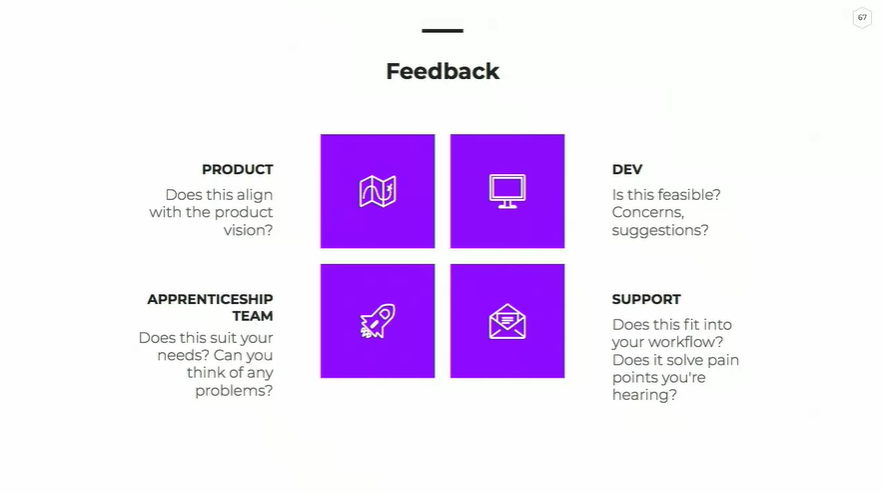

# Presenting Design Ideas - Notes

## Know your audience

- Roles and backgrounds
- Their goals and challenges
- Internal or external?
- Formal or casual?

---

## State the Problem and Goals

- A **[user role]** who feels **[negative feeling]** about **[something]** needs to **[do something]** but faces **[an obstacle]**.
- Receive feedbacks from the user.
- Goals: What are we trying to achieve.

---

## Research the Problem

At this point, go deeper into the problem by including your research. Include any relevant research about the target audience, including personas, empathy maps, survey responses, user testing feedback, and so on.

---

## Solving the Problem

Now it's time to present your solution to the design problem! Begin by defining your hypothesis, and then explain your approach.

---

## Feedback

Be sure to leave time at the end of your presentation to address any remaining feedback. If you have a link to your design, share it so everyone can interact with the design and take it in at their own pace.

---

## Outline

_Agenda_

- Meeting goal

_The Problem_

- Problem statement
- User feedback

_Goals_

- Constraints / Requirements
- Assumptions

_Researching the Problem_

- Audience (Personas, Empathy Maps)
- Flow (User Flows for user and admin)
- Current design

_Solving the Problem_

- Rethinking the flow
- Mockups

_Project Plan_

- Timeline
- Content needed

_Feedback_

- Prompts for the feedback you want

_Thank you_
