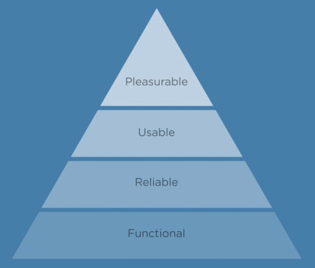

# UX Content Strategy - Notes

_With so many websites and apps offering similar content and features, you need to provide a unique experience to compete - something memorable and enjoyable that resonates with your users. UX Content is how it’s done. From your home page and product descriptions down to your error messages, UX content can turn generic interactions into memorable experiences. By establishing a unique voice and personality, you can create an environment that welcomes, supports, and inspires users during their visit._

---

## Understanding UX Content

Connecting with users on an emotional level creates an experience that can help you build lasting relationships with users.

### **New Terms:**

**UX Content -** the collection of information, instructions, and other pieces you create for a site that establishes a tone and adds personality to your interactions

### **Further Reading:**

- **[User Experience Design](http://semanticstudios.com/user_experience_design/)**, by Peter Morville
- **[Personality in Web Design](https://savyagency.com/personality-in-web-design-its-all-about-emotion/)**, by Christina Brown

---

## Why UX Content Matters

Diving into the psychology behind UX Content and how creating emotional reactions will lead to specific benefits related to website metrics.

### **New Terms:**

**Maslow’s Hierarchy of Needs** - theory from psychologist Abraham Maslow regarding the most basic needs required by humans: physiological, security, social, esteem, and self-actualization

**Aarron Walter’s pyramid of user needs** - based on Maslow’s Hierarchy of Needs, Walter proposes that users set similar priorities for websites: functional, reliable, usable, and pleasurable

**User engagement** - how often users interact with you measured by the number and/or type of action they take

---

## Descriptive UX Content

### **New Terms:**

**Descriptive UX Content** - Detailed content that confirms user needs for relevant goals and preferences; explains or illustrates the value of something, and builds trust with users.

### **Further Reading:**

- **[UX Writing: How to do it like Google with this powerful checklist](https://uxplanet.org/ux-writing-how-to-do-it-like-google-with-this-powerful-checklist-e263cc37f5f1)**, by Guy Ligertwood
- **[Prescriptive and descriptive labels](https://uxdesign.cc/prescriptive-and-descriptive-labels-5dc9778ae655)**, by Jorge Arango

---

## Helpful UX Content

How to create UX Content that provides help and guidance at all times, anticipating needs and solving problems before users get lost or frustrated.

### **New Terms:**

**Helpful UX Content** - Detailed content that provides relevant, instructional support; keeps users engaged; and provides logical pathways for users.

---

## Transparent UX Content

When users identify with a website, company, or the people behind it, they’ll be more likely to think of them and visit again. In this video, we’ll explore how UX content can be used to reveal more about the motivations and values behind you and your brand.

### **New Terms:**

**Transparent UX Content** - Content that communicates the personality, values, and identities behind a company or brand in order to build trust, create connections, and reveal the meaning behind its actions.

---

## Inspirational UX Content

How to inspire users through UX Content, whether you’re trying to get them to use features you’ve built or understand the possibilities open to them.

### **New Terms:**

**Inspirational UX Content** - Content that shares examples, stories, and provides a look at new possibilities to compel users to stay engaged, take action, and achieve goals.

---

## Defining Personality

### **New terms:**

- **Brand personality** - the way in which you communicate that reflects who you are and what you value as a brand
- **Personality trait spectrum** - The range between two opposite personality traits used to determine a brand personality - For example fun vs. serious, or casual vs. formal

---

## Status and Error Messages

How personality and voice could be applied to simple pieces of website and app messaging - such as status and error messages - to improve UX and understanding.

### **Further Reading:**

- **[5 User Experience Tips for Creating the Best Error Messages](https://freshsparks.com/user-experience-tips-best-error-messages/)**

---

## Help and Support Content

How to create help and support content with the appropriate tone and voice, reflecting your personality and empowering your users to keep moving forward instead of giving up.

---

## Product Pages and Descriptions

How to create UX Content for product pages, including informative and interesting descriptions, specifications that have relevance for the user, and visual content that shows possibilities users can embrace.

---

## Brand Identity and Values

How UX Content can help you introduce yourself to users, whether you’re producing a video to share your values, writing up a corporate history, creating bios for a team, or taking a stand on an important issue.

---

## Who is responsible for UX Content?

The role of UX content within design and development teams, how it impacts many parts of a project, and who ultimately is responsible for creating it.

## Implementing UX Content

- Products descriptions
- Help and support sections
- Details about the brand or company
- Anywhere users interact with the site
- Your entire site can be impacted by your UX content approach

## Who is responsible for UX Content?

- Content creators
- Design
- Development
- User interface
- Product management
- Support teams
- PR and social

## The Benefits of Connecting Team Goals to UX Content

- Improve the UX
- Increase engagement
- Improve feedback
- Generate more conversations

---

## Creating a UX Content Guide

Every person creating a website or app should understand the basic concepts behind UX Content, including how and why to create it.

## UX Content Guide

- Reference for content creators
- Brand personality and attributes
- Priorities
- UX examples

## Creating a UX Content Guide

- Describe your voice in three words
- Define your top priority
- List your personality attributes
- Organize your ideas
- Include content examples

### **New terms:**

- **UX Content Guide** - reference for content creators that provides guidance about how to create an overall website/app experience that’s consistent and effective

### **Further Reading:**

- [A complete process for developing a content style guide](https://gathercontent.com/blog/tone-of-voice-guide)
- [Website Style Guide Resources](http://styleguides.io/)

---

## UX Content Strategy

How to evaluate the success of your UX content efforts.

## Listening for feedback

- In person
- Email
- Contact forms
- Help desk
- Social media

## UX Survey Sample Questions

- How easy is our website/app to use?
- What do you like most/least about our website/app?
- What emotion comes to mind when you use our website/app?

## UX Content Surveys

- Details are important
- Don't be afraid to ask open-ended questions
- Look for patterns
- Don't focus on a small number of strong reactions
- Share the results with your team

## Important UX Metrics

- Average time on site
- Shopping cart abandonment rate
- Number of help requests

## Think about how you can...

- Be more descriptive, helpful, transparent, and inspirational
- Show your voice and personality in your product
- Make that voice consistent
- Reflect who you are and what you believe in

### **Further Reading:**

- [20+ User Experience Survey Questions and Templates for Inspiration](https://www.mockplus.com/blog/post/user-experience-survey-questions)
